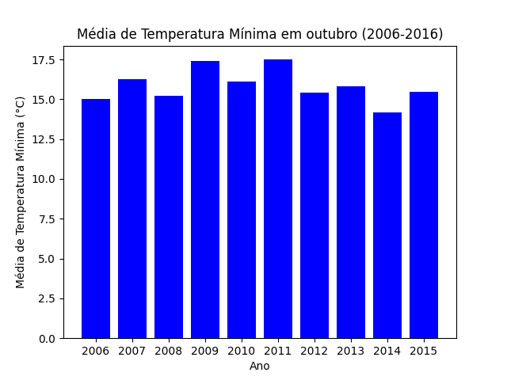

# Análise Climática

Este repositório contém um código Python para leitura, análise e visualização de dados climáticos. Ele permite a inspeção de intervalos de tempo específicos, cálculo de médias de temperatura e identificação do mês mais chuvoso, além de gerar gráficos para auxiliar na interpretação dos dados.

This repository contains Python code for reading, analyzing, and visualizing climate data. It allows inspection of specific time intervals, calculation of temperature averages, and identification of the rainiest month, as well as generating graphs to assist in data interpretation.

## Dados Utilizados

O código utiliza um arquivo CSV contendo informações climáticas, que devem seguir o formato abaixo:

The code uses a CSV file containing climate data, which should follow the format below:

```csv
data,precip,maxima,minima,horas_insol,temp_media,um_relativa,vel_vento
01/01/2006,10.2,30.5,20.1,7.5,25.3,80,12.4
02/01/2006,5.6,29.8,19.5,6.3,24.7,75,10.2
```

As colunas são:
- `data`: Data da medição (DD/MM/AAAA)
- `precip`: Precipitação (mm)
- `maxima`: Temperatura máxima (°C)
- `minima`: Temperatura mínima (°C)
- `horas_insol`: Horas de insolção
- `temp_media`: Temperatura média (°C)
- `um_relativa`: Umidade relativa (%)
- `vel_vento`: Velocidade do vento (m/s)

## Funcionalidades

- **Leitura de Dados**: Carrega os dados a partir de um arquivo CSV.
- **Visualização de Intervalo**: Exibe informações climáticas dentro de um intervalo de tempo escolhido pelo usuário.
- **Identificação do Mês Mais Chuvoso**: Determina qual mês teve maior volume de precipitação.
- **Média da Temperatura Mínima**: Calcula a média da temperatura mínima de um determinado mês.
- **Média Geral da Temperatura Mínima**: Calcula a média geral da temperatura mínima para um intervalo de tempo.
- **Gráficos**: Gera gráficos de temperatura mínima ao longo dos anos.
- **Análise de Ondas de Calor**: Identifica períodos de calor extremo com base nos dados históricos.

## Tecnologias Utilizadas

- **Python 3.x**
- **Matplotlib**: Para a geração de gráficos

## Como Executar o Projeto

1. **Instale as dependências necessárias**:
   ```sh
   pip install matplotlib
   ```

2. **Coloque seu arquivo de dados (CSV) na mesma pasta do código e certifique-se de que ele está no formato esperado**.

3. **Execute o script**:
   ```sh
   python analise_climatica.py
   ```

4. **Siga as instruções no terminal para selecionar opções de análise.**

## Exemplos de Análise e Gráficos

### Exemplo de Visualização de Intervalo

Usuário informa o intervalo: **Janeiro de 2010 a Dezembro de 2012**

```
Data: 01/01/2010, Precipitação: 12.5
Data: 02/01/2010, Precipitação: 5.8
...
```

### Exemplo de Identificação do Mês Mais Chuvoso

```
Mês mais chuvoso: 05/2014, Precipitação: 320.4 mm
```

### Exemplo de Gráfico Gerado

O código pode gerar um gráfico da média de temperatura mínima de um determinado mês ao longo dos anos:



---

## 📄 Licença

Este projeto está sob a MIT License.

This project is licensed under the MIT License.

### MIT License


